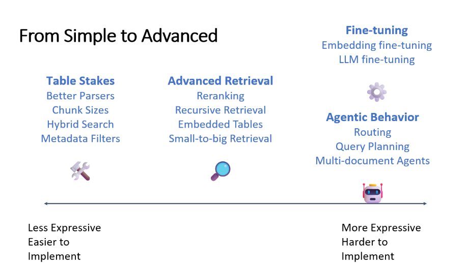
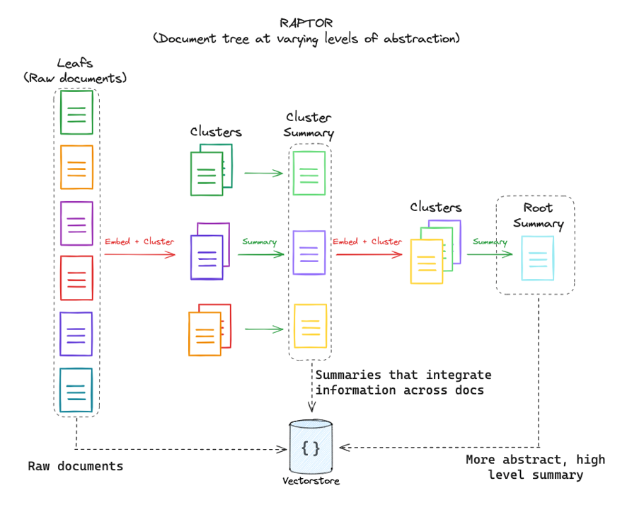

# Table of Contents

- [Table of Contents](#table-of-contents)
- [Advance-RAG](#advance-rag)
  - [Introduction](#introduction)
  - [Objective](#objective)
  - [Directions We Can Take](#directions-we-can-take)
  - [LLM (Large Language Models)](#llm-large-language-models)
    - [Commercial LLM APIs](#commercial-llm-apis)
    - [Local LLM Options](#local-llm-options)
  - [Embedding Models](#embedding-models)
  - [Data Processing in RAG System](#data-processing-in-rag-system)
  - [Types of Data Extraction](#types-of-data-extraction)
  - [Current Technology Stack](#current-technology-stack)
    - [LLM: Usage of OpenAI](#llm-usage-of-openai)
    - [Data Processing: Implementation of RAPTOR](#data-processing-implementation-of-raptor)
    - [Data Extraction: Methods for Handling Diverse Data Formats](#data-extraction-methods-for-handling-diverse-data-formats)
  - [Future Directions](#future-directions)
    - [Fine-Tuning LLM:](#fine-tuning-llm)
    - [2. **RAFT (Retrieval-Augmented Fine-Tuning)**:](#2-raft-retrieval-augmented-fine-tuning)
    - [3. **Local LLM Deployment**](#3-local-llm-deployment)
    - [4. Web UI Development: Open WebUI and LangChain Integration](#4-web-ui-development-open-webui-and-langchain-integration)
      - [Open WebUI (Formerly Ollama WebUI)](#open-webui-formerly-ollama-webui)
      - [Building an LLM App with LangChain](#building-an-llm-app-with-langchain)
    - [5. PDF Extraction:](#5-pdf-extraction)
  - [Citations](#citations)

Check out the [Readme file](readme.md) file to setup and Evaluate current RAG System.

# Advance-RAG

## Introduction

In the realm of medical research, the vast and ever-expanding corpus of literature necessitates advanced information retrieval systems to harness and synthesize knowledge effectively. The advent of Retrieval-Augmented Generation (RAG) represents a significant leap forward, melding the power of large language models (LLMs) with dynamic data retrieval mechanisms. This synergy enables the generation of contextually rich, precise, and relevant information, tailoring responses to complex queries with unprecedented accuracy.

RAG systems augment traditional data retrieval approaches by integrating real-time search with generative AI capabilities, thus providing enhanced analytical depth and breadth in medical research. This paradigm shift not only streamlines the extraction of actionable insights from large datasets but also paves the way for novel discoveries and innovations in healthcare.

## Objective

The primary objective of this project is to develop an advanced information retrieval system, RAG (Retrieval-Augmented Generation), designed to navigate and extract insights from extensive corpuses of medical research papers effectively. This system leverages the capabilities of AI to enhance the accessibility and utilization of medical research data, driving a more informed future in the medical field.

- **Develop an Advanced RAG System**: Build a sophisticated RAG system capable of multi-hop reasoning and dynamic query modification, providing precise and contextually relevant answers from vast research paper corpuses.
  
- **Integration of AI and Medical Research**: Utilize AI to sift through and synthesize complex data from medical research, facilitating a deeper understanding of medical information and aiding in the advancement of healthcare solutions【19:0†Info of concepts used for RAG.txt】.

## Directions We Can Take

To craft a sophisticated RAG system, especially for the domain of medical research, several strategic approaches and methodologies are considered pivotal. Here are the key directions:

1. **RAG Foundations**: Understanding the fundamentals of the Retrieval-Augmented Generation model is crucial. This entails grasping the model's basic operations, its integration into the retrieval process, and the enhancement of output through the dynamic incorporation of external data sources.

2. **Naive vs Advanced RAG**: A comparative exploration of RAG's capabilities, ranging from its most basic implementations to more complex configurations. This involves examining the transition from straightforward retrieval tasks to intricate scenarios requiring multi-hop reasoning and query modification, addressing challenges such as data integration quality, contextual understanding, and user intent recognition.

3. **Fine-tuning LLMs for Precision**: Delving into strategies for fine-tuning Large Language Models to achieve higher precision in information retrieval and response generation. This includes adapting LLMs for specific domains, enhancing their ability to utilize relevant documents effectively while excluding irrelevant information.

4. **LLM Prompt Engineering**: The art of fine-tuning prompts to elicit specific, relevant information from LLMs. This involves crafting prompts that guide the model towards generating responses with a high degree of relevancy and precision, essential for tasks such as sub-question generation where accuracy is critical.

5. **Data Processing Spectrum**: Addressing the full spectrum of data handling, from the initial ingestion of raw data to employing advanced methodologies like RAPTOR for improved retrieval and reasoning. This includes strategies for document hierarchies, vector database retrieval, and the employment of chunking strategies to optimize model performance.



Each direction underscores the multifaceted approach required to develop a robust and effective RAG system for medical research, aiming to enhance the accessibility, comprehension, and utility of vast data corpuses through cutting-edge AI and information retrieval technologies.


## LLM (Large Language Models)

### Commercial LLM APIs
Commercial Large Language Model (LLM) APIs, such as those offered by OpenAI and Claude (Anthropic), play a significant role in medical data retrieval by providing advanced natural language processing capabilities. These APIs facilitate:

- **Highly Accurate Information Retrieval**: Leveraging the extensive training on diverse datasets, commercial LLMs can understand and process complex medical queries, returning precise and relevant information.
- **Natural Language Understanding and Generation**: They excel in interpreting natural language queries and generating human-like responses, making them invaluable for synthesizing medical research findings and patient data.
- **Scalability and Ease of Integration**: Commercial APIs offer scalable solutions that can handle vast amounts of queries, integrated seamlessly into existing medical research platforms and systems.
- **Continuous Improvement**: These models are regularly updated with the latest advancements in AI and machine learning, ensuring state-of-the-art performance.

### Local LLM Options
Deploying LLMs locally offers control over data privacy and customization but comes with its set of trade-offs. The comparative aspects of local LLM deployments include:

| Model              | Parameters   | Size      | Trade-offs                                                     |
|--------------------|--------------|-----------|----------------------------------------------------------------|
| **Zephyr-7B**      | 7 billion    | Large     | Requires significant computational resources for deployment and operation but offers detailed and nuanced control over data processing and privacy. |
| **GPT-Neo/GPT-J**  | Various      | Various   | Open-source alternatives with a range of sizes and capabilities, suitable for localized deployment with trade-offs in terms of performance compared to top-tier commercial options. |
| **Jurassic-1 Mini**| 1 billion    | Moderate  | Offers a balance between performance and resource requirements, suitable for medium-scale local deployments. |

Deploying LLMs locally allows for:

- **Enhanced Data Privacy**: Keeping sensitive medical data on-premises or within a controlled cloud environment addresses privacy concerns.
- **Customization**: Ability to fine-tune the models on specific medical datasets, improving the relevance and accuracy of responses.
- **Reduced Dependency**: Local deployments reduce reliance on external APIs, mitigating risks related to internet connectivity and API changes.

However, these benefits come at the cost of higher initial setup complexity, ongoing maintenance, and potentially significant hardware investments. Balancing these factors is crucial when choosing between commercial LLM APIs and local deployment options for medical data retrieval tasks.
 vs Size (GB)")
| # of parameters (B) | GB of RAM (float32s) | GB of RAM (float16s) | GB of RAM (int8s) | GB of RAM (int4s) |
|---------------------|----------------------|----------------------|-------------------|-------------------|
| 7                   | 28                   | 14                   | 7                 | 3.5               |
| 13                  | 52                   | 26                   | 13                | 6.5               |
| 32.5                | 130                  | 65                   | 32.5              | 16.25             |
| 65.2                | 260.8                | 130.4                | 65.2              | 32.6              |

## Embedding Models

In the project's context, embedding models are crucial for transforming textual data into vector representations, enhancing the retrieval process in the RAG framework. Key points include:

- **Textual Data Representation**: Embedding models convert textual data into numerical vectors, capturing semantic nuances and enabling efficient information retrieval within large medical datasets.
- **Retrieval Efficiency**: They facilitate quick and accurate retrieval of relevant information by comparing the semantic similarity of vector representations, improving the system's ability to respond to complex medical queries.
- **Integration with RAG**: Embedding models are integral to the project’s RAG system, aiding in the indexing and clustering of documents, which is vital for the hierarchical retrieval process described by the RAPTOR methodology.
- **Optimizing Retrieval**: By embedding text at varying levels of granularity, the system can achieve more precise retrieval, impacting the overall performance of the RAG system in providing relevant and contextually rich responses【33:3†Info of concepts used for RAG.txt】.

## Data Processing in RAG System

| Component                | Purpose                                                   | Method                                               | Context in RAG                                       |
|--------------------------|-----------------------------------------------------------|------------------------------------------------------|------------------------------------------------------|
| **Document Hierarchies** | Structuring data for efficient retrieval.                 | Identifies relevant documents and chunks hierarchically. | Essential for dynamic query modification and refining search results. |
| **Vector Database Retrieval** | Enhancing retrieval through vector databases.            | Employs vector databases for efficient data access.  | Facilitates precision in search outcomes using structured knowledge.  |
| **Chunking Strategy**    | Rationalizing chunk sizes for performance.                | Breaks down documents into manageable chunks.        | Balances context provision and retrieval precision for the LLM.       |
| **Knowledge Graphs**     | Organizing complex data relationships for retrieval.      | Maps relationships between concepts and entities.    | Guides systematic retrieval and synthesis, reducing inaccuracies.     |

## Types of Data Extraction

Here's an overview of the file types that can be processed:

`anydata_Loader.py` file can handle various file types, each associated with a specific loader method from the `langchain_community.document_loaders` module. Here is a summary of the file types it can handle and the corresponding methods used for loading them:

| File Type        | Loader Method                        |
|------------------|--------------------------------------|
| **CSV**          | `CSVLoader`                          |
| **Word Document**| `UnstructuredWordDocumentLoader`     |
| **Evernote**     | `EverNoteLoader`                     |
| **Email (.eml)** | `UnstructuredEmailLoader`            |
| **EPUB**         | `UnstructuredEPubLoader`             |
| **HTML**         | `UnstructuredHTMLLoader`             |
| **Markdown**     | `UnstructuredMarkdownLoader`         |
| **ODT**          | `UnstructuredODTLoader`              |
| **PDF**          | `PyMuPDFLoader`                      |
| **PowerPoint**   | `UnstructuredPowerPointLoader`       |
| **Plain Text**   | `TextLoader` (with UTF-8 encoding)   |

These loaders are designed to process the respective file formats efficiently, extracting content to be utilized in the RAG system for information retrieval purposes.

## Current Technology Stack


### LLM: Usage of OpenAI
- **Implementation**: Utilizes OpenAI's GPT models, specifically `gpt-3.5-turbo`, for natural language processing tasks.
- **Functionality**: Powers the conversational interface, providing the ability to generate coherent and contextually relevant responses based on the input query and the retrieved information.

### Data Processing: Implementation of RAPTOR
- **Framework**: Employs the RAPTOR (Recursive Abstractive Processing for Tree Organized Retrieval) methodology for organizing and summarizing large datasets.
- **Process**: It involves clustering and summarizing documents recursively to build a hierarchical structure that optimizes the retrieval and synthesis of information.

### Data Extraction: Methods for Handling Diverse Data Formats
- **Tools & Methods**: Utilizes a custom `AnyFile_Loader.py` script integrated with various `langchain_community.document_loaders` to handle different file types:
  - **CSVLoader**: For structured data in CSV files.
  - **UnstructuredWordDocumentLoader**: For Word documents (`.doc`, `.docx`).
  - **EverNoteLoader**: For Evernote export files (`.enex`).
  - **UnstructuredEmailLoader**: For email files (`.eml`).
  - **UnstructuredEPubLoader**: For eBook files (`.epub`).
  - **UnstructuredHTMLLoader**: For web page files (`.html`).
  - **UnstructuredMarkdownLoader**: For Markdown files (`.md`).
  - **UnstructuredODTLoader**: For OpenDocument text files (`.odt`).
  - **PyMuPDFLoader**: For PDF files (`.pdf`).
  - **UnstructuredPowerPointLoader**: For PowerPoint presentations (`.ppt`, `.pptx`).
  - **TextLoader**: For plain text files (`.txt`), with UTF-8 encoding.
- **Capabilities**: The system can process a wide array of file formats, extracting and converting the content into a uniform format for further processing and analysis in the RAG system.


## Future Directions


### Fine-Tuning LLM:

  - **Implementation**: This method involves training the LLM with a large dataset that includes private or domain-specific data. The goal is to adjust the model’s parameters so that it behaves in a certain way or has expertise in a specific field, such as medical or legal.
  - **Benefits**: Fine-tuning allows the LLM to adapt to the nuances of the specific data, providing more accurate and context-relevant responses. It's especially useful for adapting the model’s behavior, like mimicking a particular speaking style or understanding domain-specific terminology.

### 2. **RAFT (Retrieval-Augmented Fine-Tuning)**:
  - **Implementation**: RAFT combines the strengths of fine-tuning and retrieval-based methods. It involves fine-tuning the model on a dataset that includes the context of information retrieval, enabling the model to learn how to integrate retrieved information effectively into its responses.
  - **Benefits**: RAFT enables the LLM to generate more informed and contextually enriched responses by leveraging both its internal knowledge (acquired through fine-tuning) and external data sources (through retrieval).

### 3. **Local LLM Deployment**

**Info:**
- **UI**: Tools like Ollama provide user interfaces for interacting with LLMs locally, mimicking functionalities similar to commercial offerings like ChatGPT.
- **Model Names**: Models such as Llama, Mistral, and others are accessible through repositories or services like Ollama, with clear naming conventions indicating their capabilities (e.g., parameter count).
- **Model Formats**: LLMs can be in various formats like PyTorch, TensorFlow, or optimized versions for reduced resource consumption, affecting how they are loaded and run locally.
- **Context Length**: Local deployment must consider the model's context length capabilities, which impacts memory usage and the depth of conversational context it can maintain.

**Ollama: Capabilities and Setup**
Ollama is a tool that enables local execution of large language models (LLMs), providing users with the ability to run models like Llama 2, Mistral, and others on their own hardware. Here are its primary capabilities:

- **Multiple Model Support**: Ollama can run various models, including different versions of Llama with varying parameter sizes, Mistral, and others, accommodating a range of computational power requirements.
- **Local Processing**: By running LLMs locally, Ollama allows for processing data on-premise, which enhances data privacy and security as sensitive information doesn't leave the user's environment.
- **Web UI**: Ollama offers a web interface, making it easier to interact with the models in a user-friendly manner, similar to ChatGPT's interface.
- **Custom Model Integration**: Users can import custom models into Ollama, providing flexibility in the types of LLMs they can deploy and use.
- **Resource Optimization**: It supports running models with different memory requirements, making efficient use of available system resources.

Here is a list of some models that Ollama supports, along with their parameters and sizes:

| Model                | Parameters | Size   |
|----------------------|------------|--------|
| **Llama 2**          | 7B         | 3.8GB  |
| **Mistral**          | 7B         | 4.1GB  |
| **Dolphin Phi**      | 2.7B       | 1.6GB  |
| **Phi-2**            | 2.7B       | 1.7GB  |
| **Neural Chat**      | 7B         | 4.1GB  |
| **Starling**         | 7B         | 4.1GB  |
| **Code Llama**       | 7B         | 3.8GB  |
| **Llama 2 Uncensored**| 7B        | 3.8GB  |
| **Llama 2 13B**      | 13B        | 7.3GB  |
| **Llama 2 70B**      | 70B        | 39GB   |
| **Orca Mini**        | 3B         | 1.9GB  |
| **Vicuna**           | 7B         | 3.8GB  |
| **LLaVA**            | 7B         | 4.5GB  |
| **Gemma 2B**         | 2B         | 1.4GB  |
| **Gemma 7B**         | 7B         | 4.8GB  |

These models vary in size and complexity, allowing users to choose one that fits their hardware capabilities and specific needs.

### 4. Web UI Development: Open WebUI and LangChain Integration

#### Open WebUI (Formerly Ollama WebUI)

Open WebUI is an advanced, self-hosted web interface designed for interacting with large language models (LLMs) locally, including Ollama and OpenAI-compatible APIs. Its key features include:

- **Intuitive Chat Interface**: Inspired by ChatGPT, it offers a familiar and user-friendly experience.
- **Responsive Design**: Ensures consistent usability across various devices.
- **Swift Performance**: Delivers fast and responsive interactions.
- **Easy Setup**: Can be seamlessly installed using Docker or Kubernetes, simplifying the initial setup process.
- **Enhanced Interactivity**: Features like code syntax highlighting, full Markdown and LaTeX support, and local RAG integration enhance the user interaction.
- **Document and Web Integration**: Users can load documents or web content directly into the chat, enriching the conversation context.

**Installation Example for Open WebUI**:
Using Docker, install Open WebUI with the following command:
```bash
docker run -d -p 3000:8080 --add-host=host.docker.internal:host-gateway -v open-webui:/app/backend/data --name open-webui --restart always ghcr.io/open-webui/open-webui:main
```
This command initializes Open WebUI, binding it to port 3000 and ensuring data persistence through volume mapping.

#### Building an LLM App with LangChain

LangChain facilitates the rapid development of LLM-powered applications. Here's how you can build a simple LLM app using LangChain and Streamlit:

1. **Environment Setup**: Install `streamlit`, `openai`, and `langchain` libraries in your development environment.
2. **App Development**: You can create a functional Streamlit app in just 18 lines of code, which interacts with an LLM to process and respond to user inputs.
3. **Deployment**: The app can be deployed to Streamlit Community Cloud, making it accessible to a wider audience.

**Code Example**:
```python
import streamlit as st
from langchain.llms import OpenAI

st.title('Quickstart App')
openai_api_key = st.sidebar.text_input('OpenAI API Key', type='password')

def generate_response(input_text):
    llm = OpenAI(temperature=0.7, openai_api_key=openai_api_key)
    st.info(llm(input_text))

with st.form('my_form'):
    text = st.text_area('Enter text:', 'What are the three key pieces of advice for learning how to code?')
    submitted = st.form_submit_button('Submit')
    if submitted and openai_api_key.startswith('sk-'):
        generate_response(text)
```

**Deployment Guide**:
To deploy, push your app code to GitHub and use Streamlit Community Cloud. This allows your app to be hosted online, offering global access to your LLM-powered application.

Through the development of web interfaces like Open WebUI and applications using LangChain, users can create powerful and accessible LLM-powered tools, enhancing the capabilities and reach of AI-driven solutions.

### 5. PDF Extraction: 

Enhancing techniques for PDF data extraction by:
1. Extracting information from tables within documents.
2. Extracting information from images within documents.

## Citations

1. [YouTube Video: "okay, but I want GPT to perform 10x for my specific use case - Here is how"](https://www.youtube.com/watch?v=Q9zv369Ggfk)
2. [YouTube Video: "Training Your Own AI Model Is Not As Hard As You (Probably) Think"](https://www.youtube.com/watch?v=fCUkvL0mbxI)
3. [GitHub: uptrain-ai/uptrain](https://github.com/uptrain-ai/uptrain)
4. [GitHub: Marker-Inc-Korea/AutoRAG](https://github.com/Marker-Inc-Korea/AutoRAG)
5. [YouTube Video: "Building Production-Ready RAG Applications: Jerry Liu"](https://www.youtube.com/watch?v=TRjq7t2Ms5I&t=469s)
6. [YouTube Video: "Building Corrective RAG from scratch with open-source, local LLMs"](https://www.youtube.com/watch?v=E2shqsYwxck)
7. [YouTube Video: "Building long context RAG with RAPTOR from scratch"](https://www.youtube.com/watch?v=jbGchdTL7d0)
8. [Reddit: "What Is Your LLM Tech Stack in Production?"](https://www.reddit.com/r/MachineLearning/comments/1b4sdru/d_what_is_your_llm_tech_stack_in_production/)
9. [YouTube Video: "Is RAG Really Dead? Testing Multi Fact Retrieval & Reasoning in GPT4-128k"](https://www.youtube.com/watch?v=UlmyyYQGhzc)
10. [YouTube Video: "Still looking at Text-to-SQL? You're out! It's now RAG2SQL! (Step-by-step)"](https://www.youtube.com/watch?v=KSbxwbLkhCQ)
11. [Medium: "Implementing Advanced RAG in Langchain using RAPTOR"](https://medium.com/the-ai-forum/implementing-advanced-rag-in-langchain-using-raptor-258a51c503c6)
12. [YouTube Video: "Private Chat with your Documents with Ollama and PrivateGPT | Use Case | Easy Set up"](https://www.youtube.com/watch?v=lhQ8ixnYO2Y)
13. [MarkTechPost: "Stanford Researchers Introduce RAPTOR"](https://www.marktechpost.com/2024/02/08/stanford-researchers-introduce-raptor-a-novel-tree-based-retrieval-system-that-augments-the-parametric-knowledge-of-llms-with-contextual-information/)
14. [Medium: "A first intro to Complex RAG (Retrieval Augmented Generation)"](https://medium.com/enterprise-rag/a-first-intro-to-complex-rag-retrieval-augmented-generation-a8624d70090f)
15. [YouTube Video: "NODES 2023 - Using LLMs to Convert Unstructured Data to Knowledge Graphs"](https://www.youtube.com/watch?v=qLdkRReMPvM)
16. [YouTube Video: "RAFT: Adapting Language Model to Domain Specific RAG"](https://www.youtube.com/watch?v=sqPckknlgDc)
17. [YouTube Video: "LlamaIndex Webinar: RAPTOR - Tree-Structured Indexing and Retrieval"](https://www.youtube.com/watch?v=Bhnq8grQm5I)
18. [YouTube Video: "A deep dive into Retrieval-Augmented Generation with Llamaindex"](https://www.youtube.com/watch?v=Y0FL7BcSigI)
19. [YouTube Video: "All You Need To Know About Running LLMs Locally"](https://www.youtube.com/watch?v=XwL_cRuXM2E)
20. [GitHub: ollama/ollama](https://github.com/ollama/ollama?tab=readme-ov-file)
21. [Ollama Library](https://ollama.com/library)
22. [LM Studio](https://lmstudio.ai/)
23. [Streamlit Docs: "Build an LLM app using LangChain"](https://docs.streamlit.io/knowledge-base/tutorials/llm-quickstart)
24. [LLM Explorer](https://llm.extractum.io/)

These citations provide a comprehensive resource list for exploring various aspects of Large Language Models (LLMs), including development, application, and specialized use cases such as RAG and RAPTOR methodologies.

