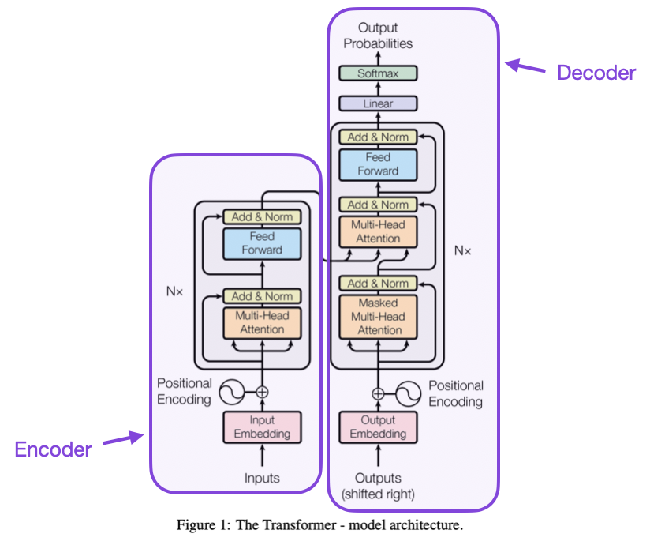
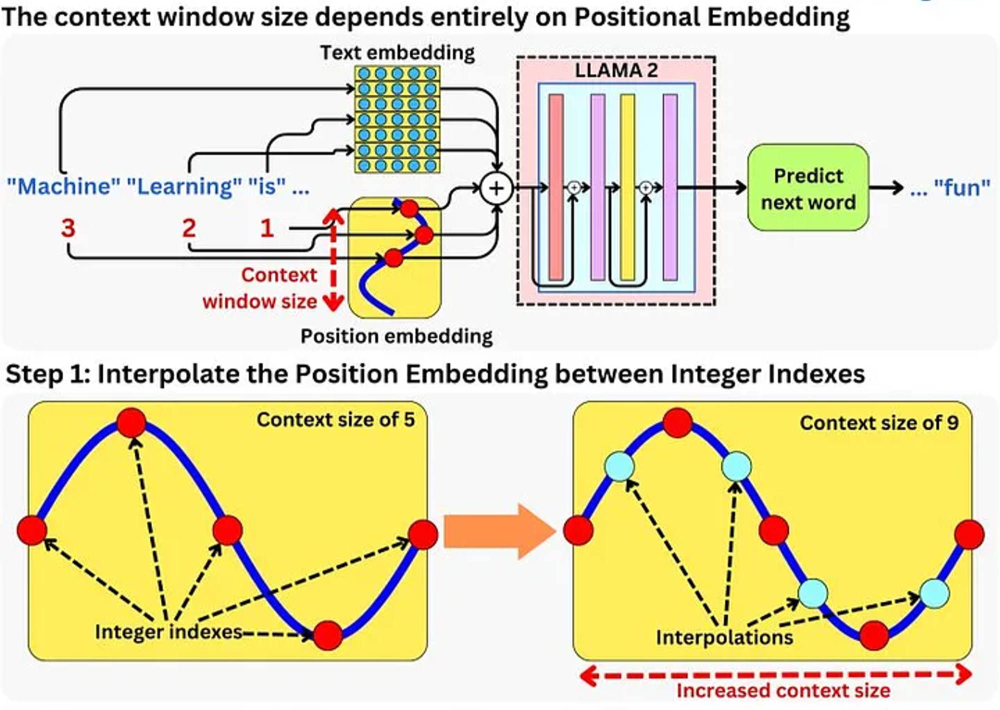
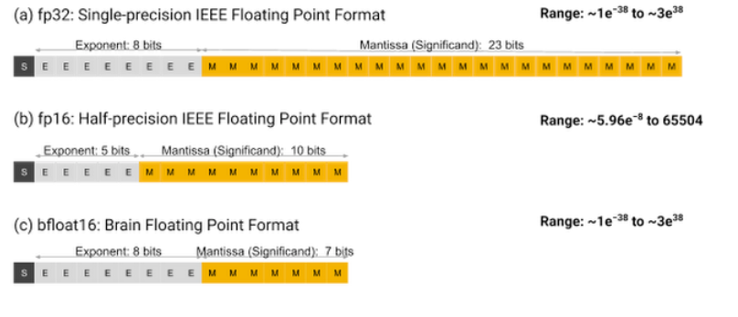
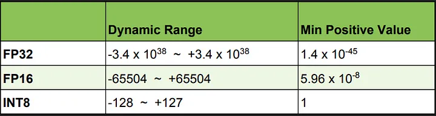
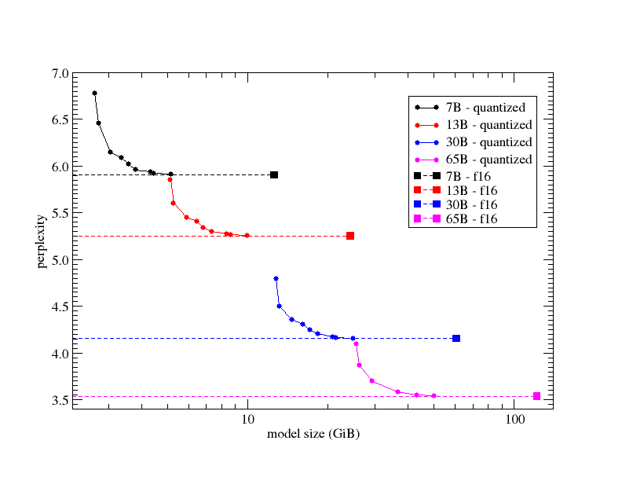
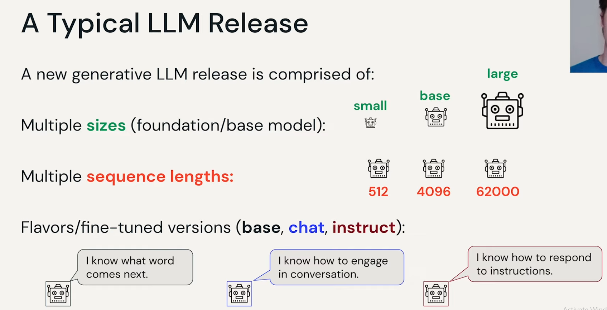
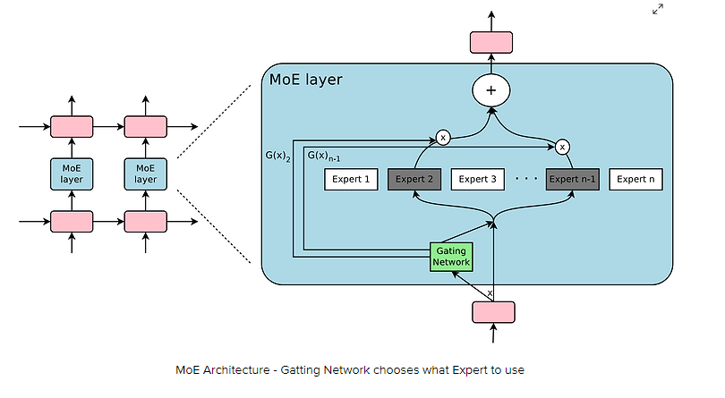

# LLM

## what are LLM?

An LLM (Large Language Model) is a type of AI that processes and generates text, built on a transformer architecture and trained with massive amounts of data to understand and mimic human language patterns.

## what are Tansformers?

The transformer architecture was introduced in the paper “[Attention is all you need](https://arxiv.org/pdf/1706.03762.pdf),” published in December 2017.

Transformers are a type of neural network architecture, they process input data in parallel rather than sequentially, which distinguishes them from recurrent neural networks (RNNs) and long short-term memory networks (LSTMs). In technical terms, transformers consist of an encoder and decoder structure, each made up of layers that include multi-head self-attention mechanisms and position-wise feed-forward networks.

The self-attention mechanism allows the model to weigh the significance of different parts of the input sequence when processing each element, thereby capturing long-range dependencies and contextual relationships in the data. The multi-head aspect of the attention mechanism enables the model to concurrently process information from different representation subspaces at different positions, enhancing its ability to learn complex patterns and nuances in the data.

Transformers are trained using large-scale datasets and employ techniques such as layer normalization and dropout to improve training efficiency and model performance. They have become foundational in developing advanced natural language processing systems, including large language models like GPT (Generative Pretrained Transformer) and BERT (Bidirectional Encoder Representations from Transformers).

This unique technique increases the model’s parameter count while maintaining cost and latency control. Despite having 46.7B total parameters, Mixtral 8x7B only uses 12.9B parameters per token, ensuring processing efficiency. Processing input and generating output at the same speed and cost as a 12.9B model creates a balance between performance and resource utilization.

## What are parameters?

In a neural network, each neuron in each layer has its weight for every connection to previous layers and a bias. In Large Language Models, the number of parameters can be extremely high, reaching into billions or even trillions.

**Potential Benefits of Confusion**: Introducing a level of randomness or "confusion" in larger models might help prevent them from overfitting to patterns seen during training, potentially improving performance in less familiar tasks or languages.

HumanEval usually get about the same performance from 4 bpw models as from FP16, i.e. they're not any worse at producing functioning Python code, and so for that particular type of reasoning task there's no *measurable* benefit from more precision than 4 bpw, at least with a relatively conservative top-P threshold of 0.8.
Base-Model Parameter count is by far the strongest indicator of how smart a model can possibly be.

## what is context window size?

The context size, or the amount of text the model can consider at once, is defined by the size of the positional embedding, which combines with the text embedding matrix to encode text.

## How to evaluate LLM (WER, perplexity... etc)?

Here are the evaluation metrics mentioned in the text, followed by a concise explanation of each:

1. **Word Error Rate (WER)**: Measures the percentage of errors in machine-generated text compared to a reference text. It's calculated by dividing the total number of errors by the total number of words in the reference, accounting for substitutions, insertions, and deletions. While intuitive, WER doesn't consider the severity of errors.
2. **Perplexity**: Evaluates how well a language model predicts a sample of text. It's the exponentiated negative average log probability of the observed words, with lower values indicating better model performance. Perplexity assesses the model's fluency but may not fully capture contextual accuracy.
3. **BLEU Score (Bilingual Evaluation Understudy)**: A method for evaluating machine translation accuracy, focusing on n-gram precision between machine-generated and reference texts. While widely used, BLEU is critiqued for not accounting for semantic nuances and the fluidity of language.
4. **METEOR**: An evaluation metric for machine translation that considers both precision and recall, aiming to balance out the limitations of BLEU. It incorporates synonymy and word morphology, providing a more nuanced assessment of translation quality and aligning more closely with human judgment.
5. **GEANT**: A human-centric evaluation approach for machine translation quality, assessing aspects like fluency, adequacy, and relevance through expert reviewer ratings, offering a subjective but comprehensive quality measure.
6. **ROUGE (Recall-Oriented Understudy for Gisting Evaluation)**: Focuses on recall by comparing the overlap of n-grams or skip-grams between machine-generated summaries and reference texts, commonly used for evaluating summarization tasks.
7. **Semantic Similarity**: Utilizes word or sentence embeddings to gauge the closeness in meaning between machine-generated and human-written texts, reflecting the model's ability to capture contextual and semantic nuances.
8. **Human Evaluation Panels**: Involves subjective analysis by trained evaluators to assess language model outputs across various criteria, providing detailed and holistic feedback on model performance.
9. **Interpretability Methods**: Techniques like LIME (Local Interpretable Model-agnostic Explanations) and SHAP (Shapley Additive explanations) are used to understand and explain the decision-making process of models, enhancing transparency.
10. **Bias Detection and Mitigation**: Identifies and addresses biases in training data and model outputs, ensuring the model's fairness and ethical use.
11. **Multidimensional Evaluation Frameworks**: Such as FLUE (Few-shot Learning Evaluation) and the PaLM benchmark, assess LLMs across a broad range of tasks and criteria, offering a comprehensive view of their capabilities and performance.

## what is quantization?

Quantization is the process of mapping a large set of input values to a smaller set of output values. In the context of neural networks, it usually means reducing the precision of the weight values. This reduction in precision can lead to significant savings in storage and computational speed.

## what is LLM flavours text, chat, instruct?

## What is MOE (**MoE**)?

In **traditional models**, all tasks are processed by a single, densely packed neural network, akin to a generalist handling every problem. However, for complex problems, it becomes **hard to find a generalist model capable of handling everything which is why Mixture of Experts LLM is so valuable**.

Here's a surprising revelation: to build an LLM application, you will, of course, need an LLM. However, when you break down the functionalities of your LLM app, you'll find that, like many other applications, different components are designed to serve very distinct purposes. Some components may be tasked with retrieving relevant data from a database, others might be engineered to generate a "chat" experience, and some could be responsible for formatting or summarization. Similar to traditional machine learning, where combining different models in ensemble techniques like boosting and bagging, Mixture of Experts in LLMs leverages a set of different transformer models, that are trained differently and leverages ML to also weight them differently to generate a complex inference pipeline. 

On June 20th, George Hotz, the founder of self-driving startup [Comma.ai](http://comma.ai/), revealed that GPT-4 is not a single massive model, but rather a combination of **8 smaller models**, each consisting of **220 billion parameters**. This leak was later confirmed by Soumith Chintala, co-founder of PyTorch at Meta.

***`GPT4 -> 8 x 220B params = 1.7 Trillion params`***

For context, **GPT-3.5 has around 175B parameters**. However, just like we will cover in Mixtral, the calculation of the total number of parameters when using MoE is not so direct since only FFN (feed-forward network) layers are replicated between each expert, while the other layers can be shared by all. This may significantly decrease the total number of parameters of GPT-4. Regardless the total number should be somewhere between **1.2-1.7 Trillion parameters**.