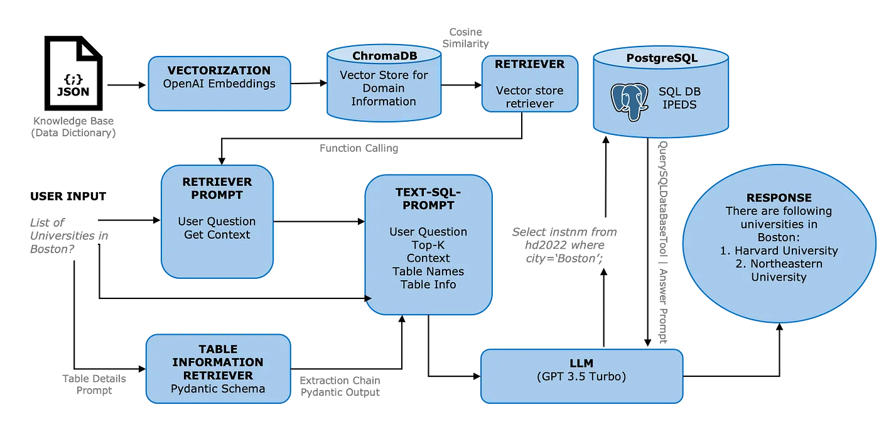

## Table of Contents
- [Introduction to Retrieval-Augmented Generation (RAG)](#introduction-to-retrieval-augmented-generation-rag)
  - [What is Retrieval-Augmented Generation (RAG)?](#what-is-retrieval-augmented-generation-rag)
  - [Why is Retrieval-Augmented Generation important?](#why-is-retrieval-augmented-generation-important)
  - [What are the benefits of Retrieval-Augmented Generation?](#what-are-the-benefits-of-retrieval-augmented-generation)
  - [How does Retrieval-Augmented Generation work?](#how-does-retrieval-augmented-generation-work)
  - [What is the difference between Retrieval-Augmented Generation and semantic search?](#what-is-the-difference-between-retrieval-augmented-generation-and-semantic-search)
- [Introduction to Advanced RAG](#introduction-to-advanced-rag)
  - [Database and Query Construction](#query-construction)
    - [RAG on SQL Databases (Relational DBs)](#rag-on-sql-databases-relational-dbs)
      - [Text-to-SQL Architecture with LLM](#text-to-sql-architecture-with-llm3)
      - [Text-to-SQL Architecture with Context Injection and LLM](#text-to-sql-architecture-with-context-injection-and-llm)
    - [GraphRAG (Graph Databases)](#graphrag-graph-databases)
      - [Constructing a Knowledge Graph](#constructing-a-knowledge-graph)
      - [Graph Retrieval RAG](#graph-retrieval-rag)
      - [Hybrid Retrieval: Graph + Vector](#hybrid-retrieval-graph--vector)
  - [Query Translation](#query-translation)
      - [Multi-Query Translation](#multi-query-translation)
      - [RAG Fusion](#rag-fusion)
      - [Decomposition](#decomposition)
      - [Step-Back Prompting](#step-back-prompting)
      - [HyDE](#hyde)
  - [Indexing](#indexing)
      - [Chunking Strategy](#chunking-strategy)
      - [Document Hierarchies Indexing](#document-hierarchies-indexing)
  - [Retrieval](#retrieval)
      - [Cohere Rerank](#cohere-rerank)
      - [LLM Rerank](#llm-rerank)
      - [Sentence Window Retrieval](#sentence-window-retrieval)
  - [Example of an Advanced RAG](#example-of-an-advanced-rag)
  - [Evaluation](#evaluation)


# Introduction to Retrieval-Augmented Generation (RAG)

## What is Retrieval-Augmented Generation (RAG)?

Retrieval-Augmented Generation (RAG) is the process of optimizing the output of a large language model, so it references an authoritative knowledge base outside of its training data sources before generating a response. Large Language Models (LLMs) are trained on vast volumes of data and use billions of parameters to generate original output for tasks like answering questions, translating languages, and completing sentences. RAG extends the already powerful capabilities of LLMs to specific domains or an organization's internal knowledge base, all without the need to retrain the model. It is a cost-effective approach to improving LLM output so it remains relevant, accurate, and useful in various contexts.[1]


## Why is Retrieval-Augmented Generation important?

LLMs are a key artificial intelligence (AI) technology powering intelligent chatbots and other natural language processing (NLP) applications. The goal is to create bots that can answer user questions in various contexts by cross-referencing authoritative knowledge sources. Unfortunately, the nature of LLM technology introduces unpredictability in LLM responses. Additionally, LLM training data is static and introduces a cut-off date on the knowledge it has.

## Known challenges of LLMs include:

- Presenting false information when it does not have the answer.
- Presenting out-of-date or generic information when the user expects a specific, current response.
- Creating a response from non-authoritative sources.
- Creating inaccurate responses due to terminology confusion, wherein different training sources use the same terminology to talk about different things.

You can think of the Large Language Model as an over-enthusiastic new employee who refuses to stay informed with current events but will always answer every question with absolute confidence. Unfortunately, such an attitude can negatively impact user trust and is not something you want your chatbots to emulate!

RAG is one approach to solving some of these challenges. It redirects the LLM to retrieve relevant information from authoritative, pre-determined knowledge sources. Organizations have greater control over the generated text output, and users gain insights into how the LLM generates the response.


## What are the benefits of Retrieval-Augmented Generation?

The RAG (Retrieval-Augmented Generation) technology offers several advantages for enhancing generative AI applications:

- Cost-Effectiveness: RAG provides a cost-efficient alternative to the expensive process of retraining foundation models for specific organizational needs, reducing both computational and financial burdens.
- Access to Current Information: RAG enables the LLM to tap into live data sources, ensuring the generative AI remains up-to-date with the latest research, statistics, or news, which is vital for maintaining the relevance of the information provided.
- Enhanced User Trust: By attributing sources for the information it generates, RAG increases the credibility of AI applications, fostering greater user trust.
- Increased Developer Control: RAG affords developers greater control over the AI’s data sources, which allows for efficient testing, quick adjustments in response to new requirements, and ensures the generation of appropriate and accurate content.

In essence, RAG empowers organizations to deploy generative AI more broadly and confidently, with the ability to provide verified information and adapt quickly to new data.

## How does Retrieval-Augmented Generation work?

Without RAG, the LLM takes the user input and creates a response based on information it was trained on—or what it already knows. With RAG, an information retrieval component is introduced that utilizes the user input to first pull information from a new data source. The user query and the relevant information are both given to the LLM. The LLM uses the new knowledge and its training data to create better responses. The following sections provide an overview of the process.


## What is the difference between Retrieval-Augmented Generation and semantic search?

Semantic search enhances RAG results for organizations wanting to add vast external knowledge sources to their LLM applications. Modern enterprises store vast amounts of information like manuals, FAQs, research reports, customer service guides, and human resource document repositories across various systems. Context retrieval is challenging at scale and consequently lowers generative output quality.

Semantic search technologies can scan large databases of disparate information and retrieve data more accurately. For example, they can answer questions such as, "How much was spent on machinery repairs last year?” by mapping the question to the relevant documents and returning specific text instead of search results. Developers can then use that answer to provide more context to the LLM.

Conventional or keyword search solutions in RAG produce limited results for knowledge-intensive tasks. Developers must also deal with word embeddings, document chunking, and other complexities as they manually prepare their data. In contrast, semantic search technologies do all the work of knowledge base preparation so developers don't have to. They also generate semantically relevant passages and token words ordered by relevance to maximize the quality of the RAG payload.

# Introduction to Advanced RAG

Advanced Retrieval-Augmented Generation (RAG) techniques expand the capabilities of standard RAG by integrating sophisticated components and strategies to optimize query handling and information retrieval.[2] These methodologies address the complexities of generating accurate and context-rich responses from large language models (LLMs) across various databases. Key components include:


1. **Database and Query Construction**:
   - Relational DBs: Conversion of natural language to SQL or SQL with vector.
   - Graph DBs: Conversion of natural language to Cypher query language for Graph DBs.
   - Vector DBs: Self-query retrieval and auto-generation of metadata filters from the query.

2. **Query Translation**:
   - Query Decomposition: decompose or rephrase input question. Some multi-query strategies are Step-back and RAG-Fusion  
   - Pseudo-documents: Generation of hypothetical documents with HYDE.

3. **Routing**:
   - Logical routing: Letting the language model choose the database based on the question.
   - Semantic routing: Involves embedding questions and choosing a data prompt based on similarity.

4. **Retrieval**:
   - Ranking: Rank or filter/ compress documents based on relevence like Re-Rank, RankGPT, RAG-Fusion
   - CRAG (Corrective RAG): Adding an evaluator, knowledge refining, and knowledge search steps to the pipeline
   - Active retrieval: It illustrates a cycle where if the documents retrieved are not relevant, the system may re-retrieve or obtain new data from sources like the web.

5. **Indexing**:
   - Chunk Optimization: Optimize chunk size used for embedding(Semantic Splitter)
   - Multi-representation indexing: (Parent Document, Dense X) Convert documents into compact retrieval units (e.g., a summary)
   - Specialized Embeddings: (Fine-tuning, ColBERT) Domain-specific and / or advanced embedding models
   - Hierarchical Indexing:(RAPTOR) Tree of document summarization at various abstraction levels

6. **Generation**:
   - Active retrieval: (Self-RAG, RRR) Use generation quality to inform question re-writing and / or re-retrieval of documents


## **Database and Query Construction**

- What is Query construction? 

Query construction is the process of converting a user's natural language question or search terms into a formal query that a database management system can understand and execute to retrieve the relevant information. The way this process is handled can differ significantly depending on the type of database—such as SQL, graph, or vector databases—each of which has its own query language and operational paradigms.

- How does the process differ for different databases like SQL, GRAPH and Vector?

Here's how the query construction process differs for each:

1. [**SQL Databases (Relational DBs)**:](#rag-on-sql-databases-relational-dbs)
   - **Language**: SQL (Structured Query Language).
   - **Process**: Natural language queries are parsed and translated into SQL commands. These commands are very structured, requiring explicit statements about which data to select (`SELECT`), the source tables (`FROM`), the conditions for selection (`WHERE`), and how to join various pieces of data (`JOIN`).
   
2. **Graph Databases**:
   - **Language**: Cypher, among others.
   - **Process**: For graph databases, natural language is converted into a query language like Cypher that is designed to work with nodes, relationships, and properties. The construction of these queries focuses on patterns and traversals in the graph, specifying how different entities are connected.

3. **Vector Databases (Vector DBs)**:
   - **Language**: Often use a domain-specific query language or no query language at all.
   - **Process**: These databases use vector representations for all content. Instead of using a structured query language, they interpret the query as a vector and retrieve information based on vector similarity or other mathematical operations in the vector space.

Each database type has its own set of principles and technologies for interpreting and executing queries, and query construction must align with these to ensure accurate and relevant data retrieval.

### **RAG on SQL Databases (Relational DBs)**
 **Text-to-SQL Architecture with LLM[3]**
   - **Architecture** 
     - 
   - **Architecture Components**:
     - **Natural Language Understanding (NLU)**: Interprets user queries expressed in natural language.
     - **Semantic Parsing**: Transforms the interpreted query into an SQL command that follows the syntax and structural rules of SQL.
     - **Database Execution**: Runs the SQL command against the database and returns the query results to the user.


 **Problem**
   - The LLM-based Text-to-SQL architecture often struggles with the generation of accurate SQL queries due to a lack of access to domain-specific or proprietary data, which leads to a limited context. This issue is exacerbated by the high cost and inflexibility associated with fine-tuning LLMs on specific datasets.

 **Text-to-SQL Architecture with Context Injection and LLM**
   - **Architecture[3]**
     - 

   - **Architecture Components**:
     - **Context Retrieval**: Before SQL generation, the RAG system retrieves relevant data from external databases like PostgreSQL and ChromaDB to provide a broader context.
     - **Context Augmentation**: The retrieved data is incorporated into the LLM’s processing, enhancing its understanding of the query.
     - **Enhanced LLM Query Processing**: With the additional context, the LLM generates SQL queries that are more accurate, precise, and contextually relevant.
     - **Chain Creation with LangChain**: Leveraging the LangChain Expression Language (LCEL), customized chains of operations are formulated to streamline the entire process, from data retrieval to SQL generation.
     - **Execution of SQL Queries**: The refined SQL commands are executed, ensuring results that align closely with the user’s intent and the database’s structure.

In summary, the initial Text-to-SQL architecture falls short due to the absence of a robust context, which is crucial for generating precise SQL queries. By incorporating Context Injection with RAG, the system retrieves and integrates relevant data into the query processing, enabling the generation of more accurate SQL queries and overcoming the limitations of the original LLM-only approach. The LangChain framework plays a pivotal role in managing the sequence of operations, ensuring a seamless and efficient flow from user query to database response.

### **GraphRAG (Graph Databases)**:

Graphs are great at representing and storing heterogeneous and interconnected information in a structured manner, effortlessly capturing complex relationships and attributes across diverse data types.[4]


**Why do we need Graph RAGs?**

    we observe situations where baseline RAG performs very poorly. For example:

    - Baseline RAG struggles to connect the dots. This happens when answering a question requires traversing disparate pieces of information through their shared attributes in order to provide new synthesized insights.
    - Baseline RAG performs poorly when being asked to holistically understand summarized semantic concepts over large data collections or even singular large documents.

    By using the LLM-generated knowledge graph, GraphRAG vastly improves the “retrieval” portion of RAG, populating the context window with higher relevance content, resulting in better answers and capturing evidence provenance.[5] 

**How does graph based RAG improves retrieval in comparison to Vector based RAG?**

    Baseline RAG struggles with queries that require aggregation of information across the dataset to compose an answer. Queries such as “What are the top 5 themes in the data?” perform terribly because baseline RAG relies on a vector search of semantically similar text content within the dataset. There is nothing in the query to direct it to the correct information. 

    However, with GraphRAG we can answer such questions, because the structure of the LLM-generated knowledge graph tells us about the structure (and thus themes) of the dataset as a whole. This allows the private dataset to be organized into meaningful semantic clusters that are pre-summarized. The LLM uses these clusters to summarize these themes when responding to a user query.[5] 

This approach leverages the structured nature of graph databases, which organize data as nodes and relationships, to enhance the depth and contextuality of retrieved information.

### **Constructing a knowledge graph**

Constructing a knowledge graph is typically the most challenging step. LLMs (Large Language Models) are employed to automate significant parts of the knowledge graph creation by identifying entities and their interrelationships from text, thereby suggesting optimal graph structures.

The introduction of the `LLMGraphTransformer` module into LangChain has simplified the implementation of these tasks, allowing for the seamless integration of LLM capabilities with Neo4j, a graph database platform. This setup includes setting up a Neo4j instance, which can be done via the cloud on Neo4j Aura or locally using the Neo4j Desktop application. An OpenAI key is also required for utilizing LLMs within this framework.

For practical demonstration lets take an example, data from Elizabeth I’s Wikipedia page is ingested using LangChain loaders, split into manageable documents, and then transformed into graph documents using the LLMGraphTransformer. These graph documents are subsequently stored in Neo4j, with additional configurations such as the baseEntityLabel for better indexing and include_source for linking nodes to their source documents to enhance traceability and context understanding.[4]

Creating a knowledge graph using LLMs and Neo4j can be streamlined into a step-by-step process as follows:

 **Step 1: Set Up a Neo4j Instance**
  - **Option 1:** Start a free instance on Neo4j Aura for cloud-based access.
  - **Option 2:** Download and install Neo4j Desktop to create a local database instance.
  - Set the necessary environment variables for your Neo4j instance:
    ```bash
    os.environ["OPENAI_API_KEY"] = "your_openai_key"
    os.environ["NEO4J_URI"] = "bolt://localhost:7687"
    os.environ["NEO4J_USERNAME"] = "neo4j"
    os.environ["NEO4J_PASSWORD"] = "password"
    ```

 **Step 2: Data Ingestion (Example: Elizabeth I Wikipedia)**
  - Utilize the `WikipediaLoader` from LangChain to fetch data:
    ```python
    raw_documents = WikipediaLoader(query="Elizabeth I").load()
    ```
  - Split the fetched documents into manageable chunks:
    ```python
    text_splitter = TokenTextSplitter(chunk_size=512, chunk_overlap=24)
    documents = text_splitter.split_documents(raw_documents[:3])
    ```

 **Step 3: Construct the Knowledge Graph**
  - Initialize the LLMGraphTransformer with a specified LLM (e.g., GPT-4):
    ```python
    llm = ChatOpenAI(temperature=0, model_name="gpt-4-0125-preview")
    llm_transformer = LLMGraphTransformer(llm=llm)
    ```
  - Convert the text documents into graph documents suitable for Neo4j:
    ```python
    graph_documents = llm_transformer.convert_to_graph_documents(documents)
    ```
  - Store these graph documents in Neo4j, enhancing indexing and query performance:
    ```python
    graph = Neo4jGraph()
    graph.add_graph_documents(
        graph_documents, 
        baseEntityLabel=True, 
        include_source=True
    )
    ```

 **Step 4: Inspect the Generated Graph**
  - Use the Neo4j Browser to view and analyze the generated graph. This allows you to inspect the nodes, relationships, and properties created from the text data.

By following these steps, you can effectively automate and simplify the creation of knowledge graphs, leveraging the profound understanding of language and context provided by LLMs, and structuring the data in Neo4j to enhance accessibility and usability across various applications.

### **Graph Retrieval RAG**

configuring a graph retrieval is more involved but offers more freedom. This example will use a full-text index to identify relevant nodes and return their direct neighborhood.[4]


- The graph retriever starts by identifying relevant entities in the input. For simplicity, we instruct the LLM to identify people, organizations, and locations. To achieve this, we will use LCEL with the newly added `with_structured_output` method to achieve this.
- Next we use `structured_retriever` function that starts by detecting entities in the user question. Next, it iterates over the detected entities and uses a Cypher template to retrieve the neighborhood of relevant nodes.

### **Hybrid Retrieval: Graph + Vector**

After the graph generation, we will use a hybrid retrieval approach that combines vector and keyword indexes with graph retrieval for RAG applications.


The diagram illustrates a retrieval process beginning with a user posing a question, which is then directed to an RAG retriever. This retriever employs keyword and vector searches to search through unstructured text data and combines it with the information it collects from the knowledge graph. Since Neo4j features both keyword and vector indexes, you can implement all three retrieval options with a single database system. The collected data from these sources is fed into an LLM to generate and deliver the final answer.[4]

## **Query Translation**:

Query translation techniques form a robust toolkit in RAG systems, ensuring accurate, relevant, and comprehensive information retrieval. Multi-Query Translation and RAG Fusion expand search scope, Decomposition simplifies complex queries, and Step-Back Prompting elevates queries to a more abstract level.

### **Multi-Query Translation**

Multi-Query Translation diversifies a user's query by rephrasing it into various forms. Multi-query technique uses LLM to enhances document retrieval by doing query expansion of a single query into multiple similar queries.[8]


This technique enhances the likelihood of retrieving relevant information, as each query version might align differently with the documents in the database.

### **RAG Fusion**

RAG Fusion, an extension of Multi-Query Translation, includes a crucial reciprocal rank fusion step. This method consolidates results from multiple queries into a single, optimized list, making it ideal for comprehensive information retrieval.[9]


### **Decomposition**

Decomposition addresses complex queries by breaking them into smaller sub-questions, each solved independently.[7] 


### **Step-Back Prompting**

Step-Back Prompting abstracts a specific query into a more general one, broadening the scope of information retrieval. This method generates high-level questions from specific queries, facilitating the retrieval of a wider range of related information.


First prompt the LLM to ask a generic step-back question about higher-level concepts or principles, and retrieve relevant facts about them. Use this grounding to help answer the user question.


### **HyDE**
Hypothetical Document Embedding enhances the document retrieval by using LLMs to generate a hypothetical answer to a query.
It is based on the ability of LLMs to produce context-rich answers, which, once embedded can help in refining and boosting document retrieval.[11]


## **Indexing**

### **Chunking Strategy**

Larger chunks can capture more context, but processing them takes longer and costs more money due to the noise they generate. While smaller pieces may not fully convey the necessary context, they do have less noise.


 - **TokenTextSplitter**
 This approach split the documents into smaller chunks while maintaining context by allowing for overlapping text between chunks. One time it was employed with a chunk size of 512 tokens and an overlap of 50 tokens, and other time with a larger chunk size of 3072 tokens and an overlap of 100 tokens for generating larger chunks to be summarized by the language model.
 - **SentenceWindowNodeParser** 
 used with a window size of 3 sentences, effectively creating overlapping chunks consisting of three consecutive sentences


### **Document Hierarchies indexing**

In document hierarchies, nodes are arranged in parent-child relationships and chunks are linked to them. A summary of the data is stored on each node, which facilitates rapid data traversal and helps the RAG system determine which chunks to extract.


## **Retrieval**

### **Cohere Rerank**
This technique uses a cross-encoder architecture to assess the relevance of documents to the query.
It differs from methods that process queries and documents separately, as cross-encoders analyze them jointly, allowing a more comprehensive understanding of their mutual relevance.

### **LLM Rerank**
Differs from Cohere rerank in a way that it focuses on applying LLMs directly to the task of reranking retrieved documents.
It prioritizes the comprehensive analytical abilities of LLMs over the joint query-document analysis typical of cross-encoders.
It is slower and less cost-efficient as compared to cross-encoders, but achieves higher accuracy

### **Sentence Window Retrieval**
Traditional retrieval methods often rely on using the same text chunk for both embedding and synthesis, which can lead to suboptimal results.
The key idea behind Sentence Window Retrieval is to separate the embedding and synthesis processes, allowing for more granular and targeted information retrieval. Instead of embedding and retrieving entire text chunks, this method focuses on individual sentences or smaller units of text. By embedding these smaller units and storing them in a vector database, we can perform more precise similarity searches to find the most relevant sentences for a given query.


But wait, there's more! In addition to retrieving the relevant sentences, Sentence Window Retrieval also includes the surrounding context – the sentences that come before and after the target sentence. This expanded context window is then fed into the language model for synthesis, ensuring that the generated answer has the necessary context for coherence and completeness.[6]


## **Example of an Advanced RAG**


# **Evaluation**

Evaluation are taked from article[10]


## Citation:
- [1] https://aws.amazon.com/what-is/retrieval-augmented-generation/

- [2] https://github.com/langchain-ai/rag-from-scratch

- [3] https://medium.com/@OmkarSadekar/text-to-sql-using-llm-and-context-injection-with-rag-for-large-databases-8a2ae4f171ee

- [4] https://medium.com/neo4j/enhancing-the-accuracy-of-rag-applications-with-knowledge-graphs-ad5e2ffab663

- [5] https://www.microsoft.com/en-us/research/blog/graphrag-unlocking-llm-discovery-on-narrative-private-data/

- [6] https://www.linkedin.com/pulse/sentence-window-retrieval-optimizing-llm-performance-rutam-bhagat-v24of/

- [7] https://medium.com/@kbdhunga/advanced-rag-decomposition-technique-in-langchain-c0959541cfec

- [8] https://medium.com/@kbdhunga/advanced-rag-multi-query-retriever-approach-ad8cd0ea0f5b

- [9] https://medium.com/@kbdhunga/advanced-rag-multi-query-retriever-approach-ad8cd0ea0f5b

- [10] https://medium.com/@techsachin/evaluating-advanced-retrieval-augmented-generation-comparisons-and-evaluations-of-various-rag-32fea2de155a

- [11] https://towardsdatascience.com/autohyde-making-hyde-better-for-advanced-llm-rag-619e58cdbd8e