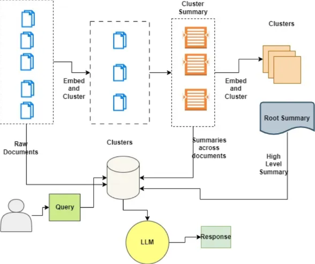

## Index

- [Setting Up Your Environment](#setting-up-your-environment)
- [Configuring OpenAI API Key](#configuring-openai-api-key)
- [Running the RAG System](#running-the-rag-system)
- [Running in Jupyter Notebook Environment](#running-in-jupyter-notebook-environment)
- [LLM Response Evaluation Experiment](#llm-response-evaluation-experiment)
  - [Experiment Setup](#experiment-setup)
  - [Complex Question Posed](#complex-question-posed)
  - [LLM Response](#llm-response)
  - [Expert Response](#expert-response)
  - [Comparison Table](#comparison-table)
  - [Final Analysis](#final-analysis)
- [Conclusion](#conclusion)
- [Directions We Can Take](Directions.md)


- For more detailed future directions, see [Directions We Can Take](Directions.md).

- For more detailed on LLMs, see [LLM](LLM/LLM.md)

- For more detailed on Advanced RAG approaches, see [RAG](LLM/RAG.md)


# Advanced-RAG Setup Guide



## Setting Up Your Environment

To run the Advanced-RAG Python file in a terminal, follow these steps:

1. Create a new conda environment:
    ```
    conda create --name RAG python=3.11.7
    ```
   
2. Activate the conda environment:
    ```
    conda activate RAG
    ```
   
3. Install required dependencies:
    ```
    pip install -U -r requirement.txt
    ```

4. Clone the Advanced-RAG repository:
    ```
    git clone https://github.com/Saurabh-Singh-55/Advanced-RAG.git
    ```

## Configuring OpenAI API Key

1. Open the `RAPTOR.py` and `RAG_OpenAI_Raptor.py` files in a text editor.
2. Set your OpenAI API key in the following line within both files:
    ```python
    os.environ['OPENAI_API_KEY'] = 'your-api-key-here' # Replace with your actual OpenAI API Key
    ```

## Running the RAG System
Since the Vector Embedding are already stored it is recommeded to use `--no-update` flag to run: 

(Recommended)If you want to run on pre-stored vector embeddings:
```
python .\RAG_OpenAI_Raptor.py --no-update
```
To update the files (stored in ./Melanoma_Papers)and create a new VectorStore:
Make sure your files are present in `Melanoma_Papers` folder then run:

```
python .\RAG_OpenAI_Raptor.py --update
```

To close the application, enter:
```
Enter your question: exit
```

## Running in Jupyter Notebook Environment

To run the RAG system within a Jupyter Notebook environment, navigate to the following file:
```
./Jupyter Notebook/Raptor_Notebook.ipynb
```

---

### Note
Make sure to replace `'your-api-key-here'` with your actual OpenAI API key. Keep your API key confidential to ensure security.


## LLM Response Evaluation Experiment

## Experiment Setup
An experiment was conducted to evaluate the responses generated by a Language Model (LLM) in comparison to an expert response on the topic of oncoplastic surgery principles in the treatment of melanoma.

### Paper Used
A list of ten papers that are related to the research on melanoma:

1. Al-Himdani et al. - 2019 - An 18-year Study of Malignant Melanoma in Childhood
2. Abdelmofeed et al. - 2023 - Extended Pedicled Perforator Plus Submental Flap for Melanoma
3. Dean et al. - 2017 - Pediatric Melanoma A 35-year Population-based Review
4. Derebaşinlioğlu and Yilmaz - 2018 - Coincidence of Malignant Melanoma and an Incidental
5. Eseme et al. - 2022 - Rintala Flap and Posterior Perichondrial Cutaneous Flap for Melanoma
6. Featherston et al. - 2020 - Cancer Stem Cells in Head and Neck Cutaneous Squamous Cell Carcinoma and Melanoma
7. Koolen et al. - 2017 - Recurrence Rates Over 20 Years in the Treatment of Malignant Melanoma Immediate Versus Delayed Reconstruction
8. Kang et al. - 2023 - Synchronous Melanoma Definition, Prognosis, and I
9. Snashall et al. - 2020 - Primary Melanoma of the Breast Parenchyma An Oncological Review
10. Walker et al. - 2020 - Acral Lentiginous Melanoma Do Surgical Approach a

These papers were used to construct a question that requires a deep understanding of all the papers to answer.

## Complex Question Posed
After reviewing the provided papers on various aspects of melanoma management and surgical techniques, here's a complex question that requires deep understanding and integration of the insights from all the papers:

### Question:

Given the advancements in surgical techniques and the understanding of melanoma's behavior, particularly in atypical locations and with regards to metastasis to regions such as the parotid gland or the breast parenchyma, how can the principles of oncoplastic surgery enhance the outcomes in patients with melanomas requiring extensive resections? Please consider the following in your answer:

#### 1. The implications of reconstructive choices on psychological outcomes and patient satisfaction, as discussed in cases involving complex nasal tip reconstructions.
#### 2. The decision-making process in surgical management when confronted with incidental findings such as a parotid mass, where diagnostic challenges arise, as seen in the case reports of cheek melanoma coinciding with an incidentally discovered parotid mass.
#### 3. The role of immediate autologous reconstruction in the context of the aggressive nature of melanomas, like the one seen in primary melanoma of the breast parenchyma, and the potential for this approach to impact the recurrence rates and overall survival.
#### 4. How can frozen section analyses during surgery for head and neck melanomas be incorporated into the broader surgical strategy to mitigate the limitations of diagnostic tools and enhance surgical planning for metastatic melanoma treatment?
This question assesses the ability to synthesize knowledge from multiple research studies and apply it to a comprehensive treatment strategy that encompasses surgical technique, diagnostic challenges, and patient-centered outcomes.

### Key Points to Address
- Psychological outcomes and patient satisfaction.
- Decision-making in surgical management when faced with incidental findings like parotid masses.
- Role of immediate autologous reconstruction in aggressive melanomas.
- Incorporating frozen section analyses in head and neck melanomas.

## RAG + LLM Response
The LLM provided a response:

**Introduction:**

Advancements in surgical techniques and the understanding of melanoma behavior have significantly impacted the management of patients with melanomas in atypical locations, such as the breast parenchyma or scalp. The principles of oncoplastic surgery play a crucial role in enhancing outcomes for patients requiring extensive resections. This includes the implications of reconstructive choices on psychological outcomes, decision-making in surgical management when faced with incidental findings like parotid masses, the role of immediate autologous reconstruction in aggressive melanomas, and the incorporation of frozen section analyses in head and neck melanomas.

**Analysis:**

1. Psychological outcomes and patient satisfaction: Complex nasal tip reconstructions serve as a prime example of how reconstructive choices can impact psychological outcomes and patient satisfaction. By offering aesthetically pleasing results, patients experience improved self-esteem and body image, leading to enhanced quality of life post-surgery. Oncoplastic surgery principles focus on not only removing the tumor but also restoring the patient's appearance and function, which is vital for overall well-being.      

2. Decision-making in surgical management: When incidental findings like parotid masses are encountered during surgery for melanomas, diagnostic challenges arise. The principles of oncoplastic surgery emphasize a multidisciplinary approach, involving oncologists, radiologists, and surgeons to navigate such complexities. Clear communication and collaboration are essential to ensure appropriate management of both the melanoma and the incidental finding, optimizing patient outcomes.

3. Role of immediate autologous reconstruction: In cases like primary melanoma of the breast parenchyma, where the disease is aggressive, immediate autologous reconstruction can play a significant role in improving outcomes. By offering immediate reconstruction, not only does it enhance patient satisfaction and quality of life, but it may also impact recurrence rates and overall survival. The restoration of the breast's form and function can positively influence the patient's physical and emotional recovery.

4. Incorporating frozen section analyses: Frozen section analyses during surgery for head and neck melanomas can aid in real-time decision-making and surgical planning. By providing immediate feedback on tumor margins and lymph node involvement, frozen sections help guide the extent of resection and the need for further interventions. This proactive approach allows for more precise surgical management, reducing the risk of incomplete excision and improving overall treatment outcomes.

**Conclusion:**

In conclusion, the principles of oncoplastic surgery play a crucial role in enhancing outcomes for patients with melanomas requiring extensive resections. By considering reconstructive choices, navigating diagnostic challenges, utilizing immediate autologous reconstruction, and incorporating frozen section analyses, surgeons can optimize treatment strategies and improve patient outcomes. A comprehensive and multidisciplinary approach is essential in addressing the complexities of melanoma management, ultimately leading to better surgical outcomes and patient satisfaction.

## Expert Response
The expert (GPT4) emphasized:
The integration of oncoplastic surgery principles into melanoma treatment strategies, particularly when extensive resections are needed, represents a significant multidisciplinary advancement. Addressing the complex question requires an analysis of the oncological and reconstructive paradigms, as well as patient-centered outcomes derived from the papers reviewed.

1. **Psychological Outcomes and Patient Satisfaction**: The shift towards patient-centered care in oncoplastic surgery has been pivotal. For instance, in nasal tip reconstructions, the use of the Rintala flap and posterior perichondrial cutaneous graft is not only a reflection of technical adaptability but also of sensitivity towards the patient's psychological state and aesthetic concerns. Such techniques, which offer less conspicuous temporary appearances and require fewer surgical interventions, are essential for ensuring patient satisfaction and can significantly influence the choice of reconstructive options.

2. **Diagnostic Challenges and Surgical Management**: Incidental findings, such as parotid masses, introduce complexity in the surgical management of melanoma. As described in the case studies, PET-CT imaging, while helpful, is not infallible. Frozen section analysis emerges as a critical intraoperative tool, allowing for real-time adjustments to surgical plans. This immediate pathological assessment can prevent over-treatment in cases of benign pathology and ensure appropriate extent of surgery in malignant conditions.

3. **Immediate Autologous Reconstruction**: The aggressive nature of melanomas, such as primary melanoma of the breast parenchyma, necessitates a prompt and comprehensive treatment approach. Immediate autologous reconstruction, following the oncoplastic principle, not only enhances aesthetic and functional outcomes but may also contribute to a patient's psychological well-being. Although it may not directly impact recurrence rates and overall survival, which are primarily influenced by the biology of the tumor and completeness of resection, it does play a role in the quality of life and could potentially influence recovery and rehabilitation, thereby indirectly affecting survival outcomes.

4. **Incorporating Frozen Section Analysis**: The limitations of preoperative diagnostic tools, as highlighted in the papers, underscore the importance of intraoperative pathology. Frozen section analysis can guide the extent of surgery, particularly in metastatic melanoma, where unexpected findings may alter the surgical plan. Integrating this real-time analysis allows for a tailored approach, potentially reducing the morbidity associated with extensive surgery and improving regional control of the disease.

In conclusion, the principles of oncoplastic surgery enhance outcomes by harmonizing oncological rigor with reconstructive finesse, all while placing a premium on patient preferences and psychological impact. This holistic approach to melanoma management—balancing tumor control with functional and aesthetic restoration and underpinned by precise intraoperative pathological assessment—embodies the evolution of contemporary surgical oncology.

## Comparison Table
Criteria | RAG+LLM Response | Expert Response
--- | --- | ---
Psychological Impact | Acknowledges impact on well-being. | Emphasizes satisfaction and quality of life.
Diagnostic Complexity | Stresses multidisciplinary decision-making. | Advocates for a proactive approach.
Reconstructive Outcomes | Suggests direct impact on survival. | Notes psychological benefits; cautious about oncological impact.
Surgical Precision | Highlights immediate pathological feedback. | Considers real-time assessment crucial.

## Final Analysis
Both the RAG+LLM and expert responses provided valuable insights, with the LLM focusing on the procedural aspects and the expert highlighting the holistic and patient-centric elements of care. The 'better' response depends on whether the emphasis is on patient-centered care or technical outcomes.

## Conclusion
The experiment showcased the capabilities of an LLM in generating comprehensive and analytical responses to complex medical queries and the importance of expert oversight in evaluating and integrating these responses into clinical practice.
